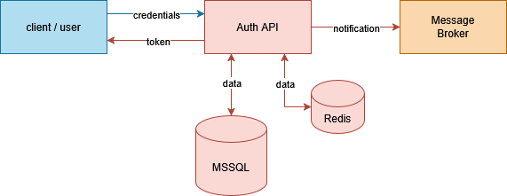

# :closed_lock_with_key: How to Authenticate

## :computer: Client Authentication
  
### Single-Factor Authentication
  
  An **access token** can be obtained using basic authentication with:\
  `POST /api/v1/token`
  
  > [!IMPORTANT]
  > External clients are required to activate a **subscription** via:\
  > `POST /api/v1/clients/{key}/subscriptions`
  
  > [!NOTE]
  > The **access token** can be validated via:\
  > `POST /api/v1/token/status`.
  
---

## :iphone: User Authentication
  
### Single-Factor Authentication
  
  **Access and refresh tokens** can be obtained using:\
  `POST /api/v2/token`
  
### Multi-Factor Authentication
  
  1. An **OTP** can be requested via:\
    `POST /api/v1/otp`
  
  2. The **OTP** can be exchanged for **access and refresh tokens** via:\
     `POST /api/v3/token`
  
  > [!IMPORTANT]
  > To authenticate with MFA, users are required to verify their email via:\
  > `POST /api/v1/email/verification/{token}`
  
  > [!NOTE]
  > The **access token** can be validated via:\
  > `POST /api/v1/token/status`.
  
  > [!TIP]
  > The **access token** can be refreshed via:\
  > `PUT /api/v2/token`
  
---

:gear: Complete API documentation can be found in [`swagger.json`](./swagger.json).

---

# Architecture & Design

> SDK: .NET Core 9\
> Database: SQL Server 2022\
> Caching: Redis

> [!NOTE]
> The application follows a layered achitecture.

## Client Single-Factor Authentication
1. Client credentials are received in the `Authorization` header using the format:  
   `Basic <base64_encoded_key>:<base64_encoded_secret>`
2. The credentials from the header are decoded.
3. A database query is executed to fetch client data using the provided `key`.
4. If the `key` exists, the `client status` is validated.
5. If the `client status` is acceptable, the system checks for an activeactive `subscription`.
6. If there is an active `subscription`, the stored `secret` is compared with the provided secret.
7. If the `secret` is valid, the `failed login attempt counter` is reset.
8. A JWT `access token` is generated, scoped to the `client ID` and the applications the client is allowed to access.

> [!IMPORTANT]
> Invalid `key` or `secret` results in HTTP status code `401 Unauthorized`.

> [!IMPORTANT]
> Invalid `client status` or missing active `subscription` results in HTTP status code `403 Forbidden`.

> [!IMPORTANT]
> If the `failed login attempt counter` exceeds the allowed limit, the `client status` is updated to `BLOCKED`.
